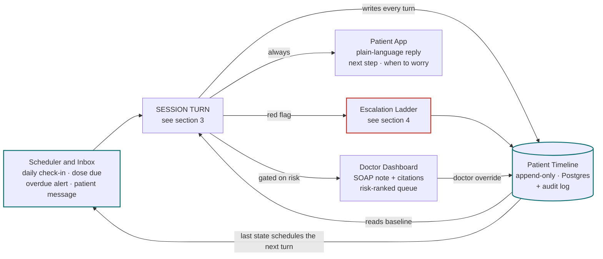
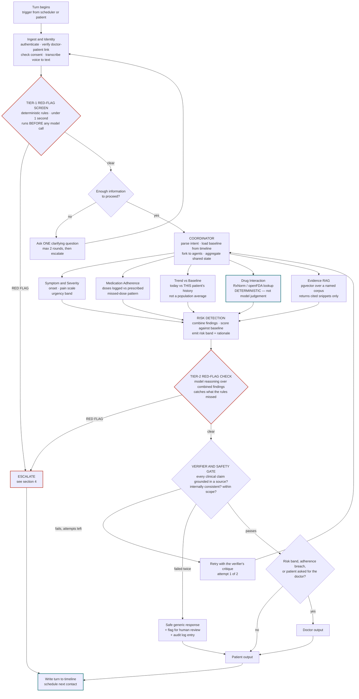
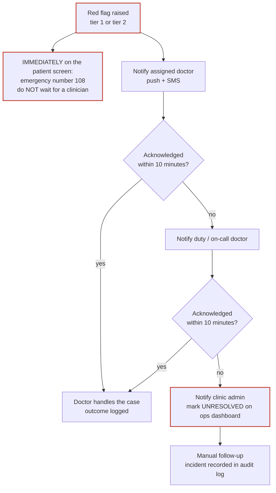

# MediAgent — Architecture (v2)

**MediAgent: An Agentic AI-Based Intelligent Patient Follow-Up and Healthcare Assistance System**
Team 11 · 4/4 CSD-C · Guide: Mr. Y. Bheem Shankar

> **The core change from v1.** Your original diagram described a single request-to-response pass
> titled *Clinical Intake Orchestration*. Your abstract describes longitudinal post-consultation
> follow-up. v2 keeps your pipeline intact and nests it inside the loop that makes it follow-up
> care: a scheduler that initiates contact, and a patient timeline that persists state between
> turns. Nothing you drew is thrown away — it is re-scoped from *the whole system* to *one turn
> of the system*.

---

## 1. What changed from v1, and why

| # | v1 (original diagram) | v2 | Why |
|---|---|---|---|
| 1 | Start → … → End, single pass | Scheduler → Session Turn → Timeline → Scheduler | Follow-up care is a loop. Without persistence and a time-based trigger, the system can only answer questions — it cannot *monitor* anyone. |
| 2 | "Fast doctor router / Doctor matching" | Escalation to the patient's **already-assigned** doctor | Doctor matching is a pre-consultation problem. Your abstract states patients have already consulted a registered doctor. |
| 3 | Medication Agent absent | **Medication Adherence Agent** added to the fan-out | It is named in your abstract and is the most defensible component of the project. |
| 4 | PII/PHI scrub at the gateway | Redaction moved to the **LLM egress boundary** and to logs | Scrubbing at ingest destroys the symptoms, drug names, and history the clinical agents need. Symptoms *are* the PHI. |
| 5 | Single red-flag check, after the Verifier | **Two-tier**: deterministic screen at ingest, LLM check after the agents | A chest-pain report must not wait 15–40s for a full fan-out, RAG lookup, and verification pass. |
| 6 | Drug Interaction Agent (unspecified source) | Explicit **RxNorm / openFDA database lookup**, not model judgement | A hallucinated drug interaction is a genuine safety hazard and the easiest live failure for an examiner to trigger. |
| 7 | "Emergency alert/protocol" — terminal box | **Escalation ladder** with acknowledgement, timeout, and fallback tier | An alert nobody receives is not a safety feature. |
| 8 | Verifier with no failure path | Bounded retry (×2) → safe fallback + human review flag | The v1 flow continued regardless of what the Verifier decided. |
| 9 | No clarification path | **"Enough information?"** branch back to the patient, capped at 2 rounds | Real check-ins arrive incomplete. |
| 10 | Both outputs on every turn | Doctor output **gated** on risk, adherence breach, or explicit request | A doctor who receives a SOAP note for every "feeling fine today" stops reading them within a week. |
| 11 | Coordinator drawn as a decision diamond | Rectangle with an explicit fork | It is a process and a parallel fork, not a branch. Notation errors get circled in reviews. |
| 12 | No audit trail | **Append-only audit log** on every agent decision, escalation, and doctor override | Mandatory for anything clinical, and it doubles as your evaluation dataset. |

---

## 2. System loop — the top-level view

This is the diagram that replaces your v1 top-level. Everything inside `Session Turn` is your
original pipeline; the two edges into and out of the timeline are what make it a follow-up system.



**Read the loop as:** the timeline holds everything known about this patient's recovery. The
scheduler reads it to decide *when* the next contact should happen and *what* to ask. The turn
reads it for baseline comparison and writes its findings back. That circular edge is the entire
difference between an intake chatbot and a follow-up system.

---

## 3. Session turn — internals

This is your v1 pipeline, corrected. One turn is bounded, resumable, and checkpointed, so a
patient can abandon a check-in and resume it hours later.



### Why the fan-out is worth defending

An examiner will ask why five agents beat one large prompt. The answer is not "because agentic AI
is the topic" — it is:

- **They have different trust levels.** A4 is a database lookup that must never be model-generated;
  A5 must cite sources; A1–A3 are judgement calls. Collapsing them into one prompt makes it
  impossible to state which parts of the output are verifiable.
- **They fail independently.** If the drug database is unreachable, that agent returns an error and
  the turn continues with an explicit gap — instead of the model quietly inventing an answer.
- **They run concurrently**, so five agents cost roughly the latency of the slowest, not the sum.

---

## 4. Escalation ladder

This replaces v1's terminal "Emergency alert/protocol" box. An escalation is not an event, it is a
protocol with a deadline.



**The patient branch is unconditional and parallel.** It does not wait on the clinician branch.
This is the single most important design decision in the project and it should be stated in the
report in exactly those terms.

---

## 5. Component specification

| Component | Kind | Reads | Writes | Failure behaviour |
|---|---|---|---|---|
| Scheduler | Deterministic (cron) | Timeline: last contact, care plan cadence | Turn trigger | Missed tick → catch-up run, never silently dropped |
| Ingest & Identity | Deterministic | Auth token, consent record, `doctor_patient_link` | Session record | Unlinked patient → hard reject, audited |
| Tier-1 Red-Flag Screen | Deterministic (rules) | Raw utterance | Escalation event | Ambiguous → escalate. Bias toward false positives. |
| Coordinator | LLM (Opus 5) | Session + patient baseline | Shared state | Cannot parse intent → clarification branch |
| Symptom & Severity | LLM (Opus 5), structured output | Utterance, prior reports | `SymptomReport` | Low confidence → mark uncertain, do not guess |
| Medication Adherence | Deterministic + LLM | `med_events`, prescriptions | `AdherenceReport` | Missing logs → report gap, not compliance |
| Trend vs Baseline | Deterministic + LLM | Timeline history | `TrendReport` | Fewer than 3 prior points → "insufficient history" |
| Drug Interaction | **Deterministic DB lookup** | Prescriptions, RxNorm/openFDA | `InteractionReport` | DB down → explicit gap, never model fallback |
| Evidence RAG | Retrieval + LLM | pgvector corpus | Cited snippets | No hit above threshold → return nothing, never improvise |
| Risk Detection | LLM (Opus 5) | All agent reports | Risk band + rationale | Disagreeing agents → escalate the band |
| Tier-2 Red-Flag Check | LLM (Opus 5) | Combined findings | Escalation event | Uncertain → escalate |
| Verifier | LLM (Opus 5) | Draft output + sources | Pass / fail + critique | Two failures → safe fallback + human flag |
| Summary (SOAP) | LLM (Opus 5), structured output | Verified findings | SOAP note + citations | Never emitted unverified |

---

## 6. Graph state

The LangGraph state object threaded through every node. Keep it typed — it is the contract between
your agents and it will save you a great deal of debugging.

```python
from typing import TypedDict, Literal, Annotated
from operator import add

class TurnState(TypedDict):
    # identity — set once at ingest, never mutated downstream
    session_id: str
    patient_id: str
    doctor_id: str
    trigger: Literal["scheduled_checkin", "dose_reminder", "patient_message", "overdue"]

    # input
    raw_input: str
    transcript: str | None

    # baseline, loaded from the timeline
    baseline: dict
    active_prescriptions: list[dict]
    recent_reports: list[dict]

    # agent outputs — each a validated Pydantic model, appended concurrently
    findings: Annotated[list[dict], add]

    # control flow
    clarification_rounds: int
    verifier_attempts: int
    red_flag: bool
    red_flag_reason: str | None
    risk_band: Literal["routine", "watch", "urgent", "emergency"] | None

    # output
    patient_message: str | None
    soap_note: dict | None
    citations: Annotated[list[dict], add]
```

---

## 7. Data model

Minimum tables. Everything clinical is **append-only** — you correct by writing a new row, never by
updating an old one. This is what makes the audit log trustworthy.

| Table | Purpose | Notes |
|---|---|---|
| `users` | Auth, role (`patient` / `doctor` / `admin`) | |
| `doctors`, `patients` | Profile detail | |
| `doctor_patient_link` | **Authorisation boundary** | Every clinical read is gated on this |
| `consent_records` | Consent granted / revoked, versioned | Revocation must be a new row |
| `care_plans` | Follow-up cadence, duration, goals | Drives the scheduler |
| `prescriptions` | Drug, dose, schedule, RxNorm code | RxNorm code is what A4 queries on |
| `med_events` | Dose marked taken / missed / skipped | Append-only |
| `check_ins` | One row per session turn | Links to findings |
| `symptom_reports` | Structured output of A1 | Append-only |
| `agent_findings` | Raw structured output of every agent | Your evaluation dataset |
| `risk_scores` | Band + rationale per turn | |
| `escalations` | Raised, notified, acknowledged, resolved, timeouts | Every state transition is a row |
| `soap_notes` | Generated + doctor-approved versions | Keep both — the diff is a metric |
| `audit_log` | Actor, action, target, timestamp, before/after | Written by a DB trigger, not app code |

---

## 8. Rendering these diagrams for the report

The Mermaid blocks above render directly in GitHub, VS Code (with the Markdown Preview Mermaid
extension), Obsidian, and Typora. For a high-resolution image to paste into the report:

1. Open <https://mermaid.live>
2. Paste a single ```mermaid block's contents
3. Export as PNG or SVG — SVG scales cleanly for print

Your original Lucidchart export is preserved at
[`diagrams/v1-original.json`](diagrams/v1-original.json) and
[`diagrams/v1-original.png`](diagrams/v1-original.png) — content unchanged, filename only. If you
would rather keep editing in Lucidchart, rebuild from section 2 and section 3 there; the node and
edge lists above are complete.

---

## Next

See [`IMPLEMENTATION_PLAN.md`](IMPLEMENTATION_PLAN.md) for the stack decisions, six-phase build
schedule, and the evaluation plan.
